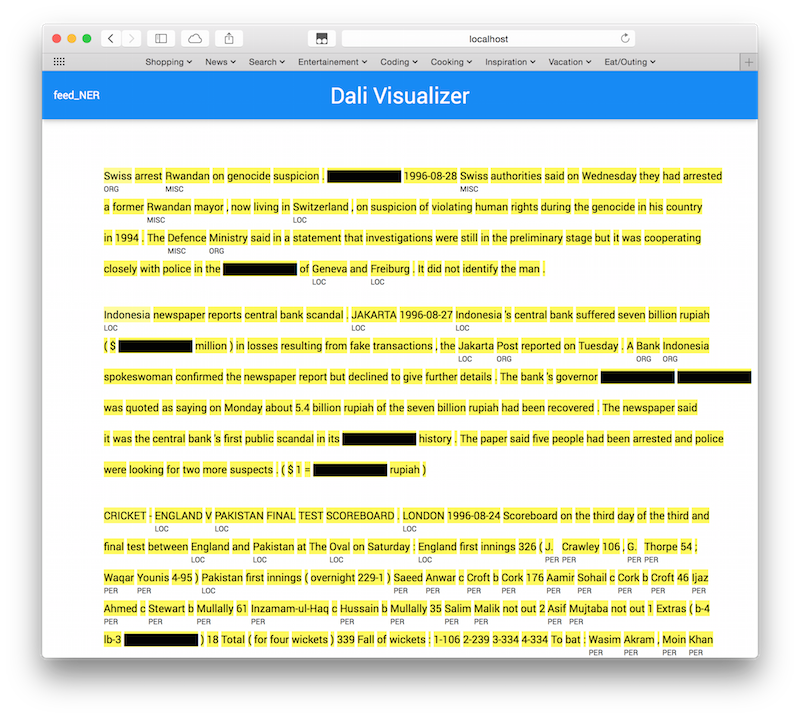

Dali Visualizer
===============


Provides a visualization web frontend for the [Dali automatic differentiation library](http://github.com/dali-ml/Dali). Allows you to see a model optimize in real time, see the predictions, and collect your results into one window.

### Dependencies

* [Python 3](https://www.python.org/download/releases/3.0/)
* [Redis](http://redis.io)
* [Dali](http://github.com/dali-ml/Dali)

### Installation

To run this visualizer you need to build the javascript files,
launch redis, and start a python server that uses tornado.
To install the dependencies for Javascript and Python run
these commands:

```bash
pip3 install -r requirements.txt
cd dali-visualizer
npm install
npm install -g gulp
npm install -g bower
bower install
gulp
```

### Run visualizer

Start the server from *top-level directory*:

```bash
./run.sh
```

And now head to [localhost:8000](http://localhost:8000)!

### Running with supervisor on Fedora Server

DISCLAIMER: Setup described below is insecure. Anybody
who is willing to write a nice write up on setting
it up in a secure manner, please submit a pull requrest.

First install supervisor:

```bash
    sudo yum install supervisor
```

Example configuration might look like this:

```
[supervisord]
logfile=/home/mers/.supervisord/supervisord.log
logfile_maxbytes=50MB
logfile_backups=10
loglevel=info
pidfile=/home/mers/.supervisord/supervisord.pid

[rpcinterface:supervisor]
supervisor.rpcinterface_factory = supervisor.rpcinterface:make_main_rpcinterface

[unix_http_server]
file=/var/run/supervisor.sock

[supervisorctl]
serverurl=unix:///var/run/supervisor.sock

[program:redis]
command=redis-server
autostart=true
autorestart=true
redirect_stderr=true
stdout_logfile=/var/log/redis.log

[program:dali_visualizer]
command=python3 /home/mers/dali-visualizer/run_server.py
redirect_stderr=true
stdout_logfile=/var/log/dali_visualizer.log
directory=/home/mers/dali-visualizer
```

To now you can do the following

```bash
    # to run the supervisor
    sudo systemctl start supervisor
    # to run supervisor as start of system
    sudo systemctl enable supervisor
    # verify everything is running
    sudo supervisorctl status
```

Forward the ports:
```bash
    sudo firewall-cmd --zone=FedoraServer --add-forward-port=port=80:proto=tcp:toport=8000
    sudo firewall-cmd --zone=FedoraServer --add-forward-port=port=6379:proto=tcp:toport=6379
```

### Usage examples

#### Named Entity Recognition


<small>an [LSTM predicting Named Entities](https://github.com/dali-ml/dali-examples/blob/master/examples/sparse_ner.cpp) in text</small>

```cpp
visualizer->throttled_feed(seconds(5), [&word_vocab, &label_vocab, &minibatch, &model]() {
    // choose an example
    auto example = std::get<0>(minibatch[utils::randint(0, minibatch.size()-1)]);
    // predict the result
    auto prediction = model.predict(example);
    // convert the input from indices back to text
    auto input_sentence = make_shared<visualizable::Sentence<float>>(word_vocab.decode(example));
    // convert the prediction from indices to labels
    auto decoded = label_vocab.decode(prediction);

    // visualize text and labels as a "parallel sentence"
    auto psentence = visualizable::ParallelSentence<REAL_t>(
        input_sentence,
        make_shared<visualizable::Sentence<REAL_t>>(decoded)
    );
    return psentence.to_json();
});
```

